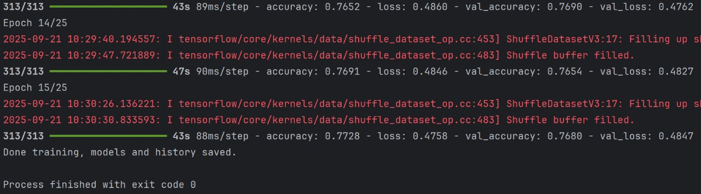
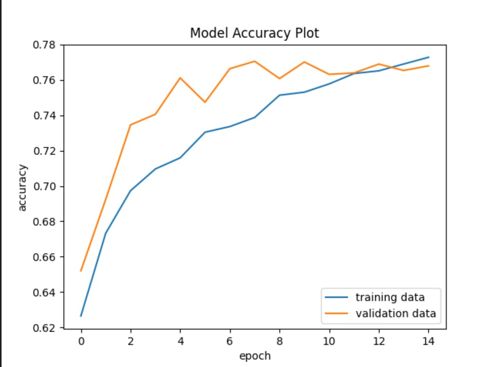
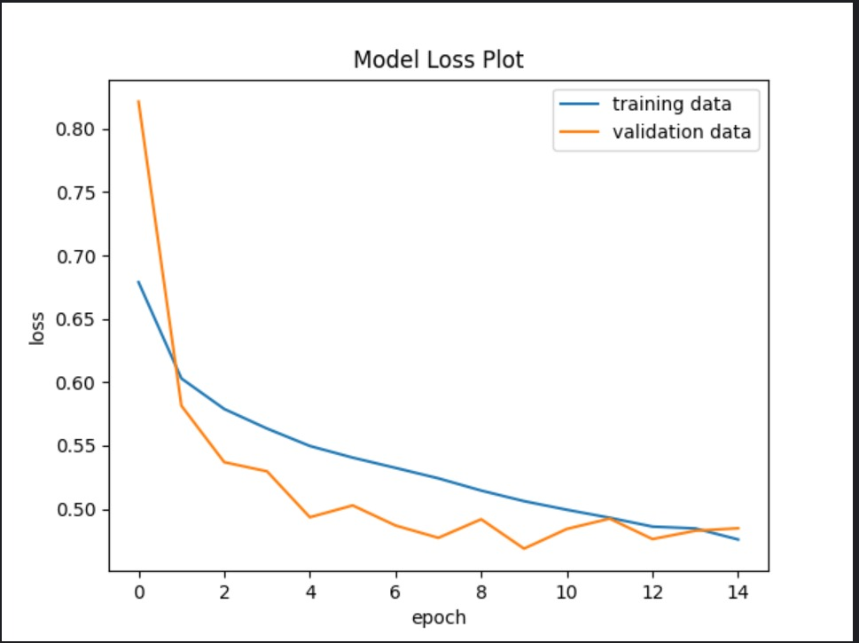
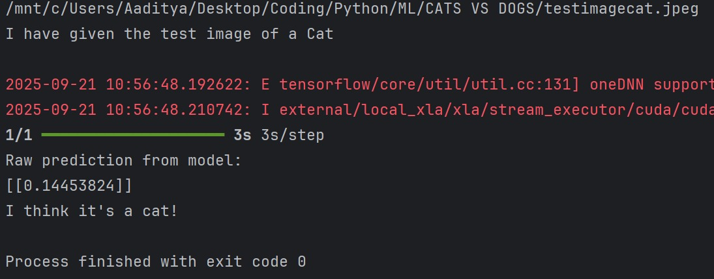
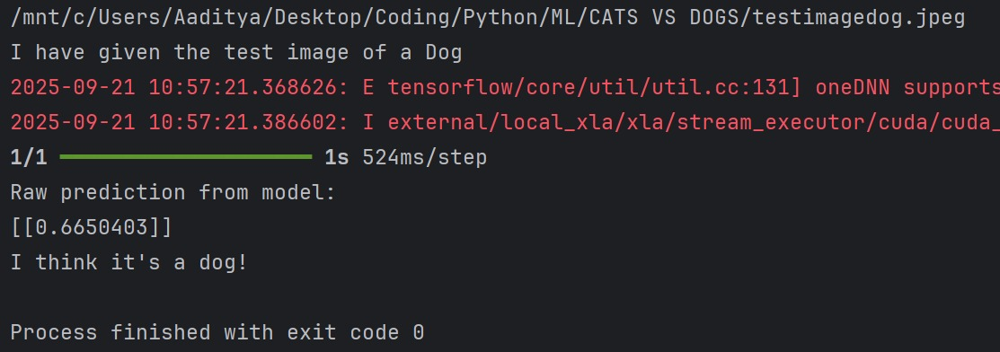

# Cat & Dog Image Classifier 🐱🐶

<br />
<div align="center">
  <h1 align="center">Cat & Dog Image Classifier</h1>

  <p align="center">
    A deep learning project to build, train, and evaluate a Convolutional Neural Network (CNN) from scratch using TensorFlow and Keras.
    <br />
    <br />
    <a href="https://github.com/Icey067/Cat-Dog-Image-Classifier">View Demo</a>
    ·
    <a href="https://github.com/Icey067/Cat-Dog-Image-Classifier/issues">Report Bug</a>
  </p>
</div>

<details>
  <summary>Table of Contents</summary>
  <ol>
    <li><a href="#about-the-project">About The Project</a></li>
    <li><a href="#key-features">Key Features</a></li>
    <li><a href="#technology-stack">Technology Stack</a></li>
    <li><a href="#getting-started">Getting Started</a></li>
    <li><a href="#usage">Usage</a></li>
    <li><a href="#model-performance--results">Model Performance & Results</a></li>
    <li><a href="#project-structure">Project Structure</a></li>
  </ol>
</details>

---

## About The Project

This project is a comprehensive, end-to-end implementation of a Convolutional Neural Network (CNN) designed for a binary image classification task. The primary goal was to build and train a deep learning model from the ground up capable of accurately distinguishing between images of cats and dogs.

The entire development process is documented here, from setting up a GPU-accelerated environment using WSL2 to tackling common machine learning challenges like overfitting. The final model achieves a stable validation accuracy, demonstrating a solid understanding of fundamental deep learning principles.

---

## Key Features
- **Custom CNN Architecture**: A sequential model built from scratch with multiple convolutional, batch normalization, and max-pooling layers.
- **GPU Acceleration**: Configured to train on an NVIDIA GPU using TensorFlow's WSL2 support for significantly faster computation.
- **Overfitting Mitigation**: Implemented key regularization techniques including aggressive **Data Augmentation** (random flips, rotations, zoom) and **Dropout** layers.
- **Efficient Data Handling**: Utilized `tf.data.Dataset` for an optimized input pipeline, including file-based caching to handle datasets larger than available RAM.
- **Performance Evaluation**: Scripts to visualize model performance (accuracy/loss) and to test the trained model on new, unseen images.

---

## Technology Stack
This project was built using the following technologies and libraries:

* 
* 
* 
* 
* 
*  (on WSL2)

---

## Getting Started

To get a local copy up and running, follow these simple steps.

### Prerequisites

You will need a Python environment with GPU support. The recommended setup is using WSL2 on Windows.
* NVIDIA GPU with CUDA-enabled drivers
* WSL2 with an Ubuntu distribution
* Python 3.10+

### Installation

1.  Clone the repository:
    ```sh
    git clone [https://github.com/Icey067/Cat-Dog-Image-Classifier.git](https://github.com/Icey067/Cat-Dog-Image-Classifier.git)
    ```
2.  Navigate to the project directory:
    ```sh
    cd Cat-Dog-Image-Classifier
    ```
3.  Create and activate a virtual environment:
    ```sh
    python3 -m venv venv
    source venv/bin/activate
    ```
4.  Install the required packages:
    ```sh
    pip install -r requirements.txt
    ```

---

## Usage

### 1. Training the Model
The original dataset can be downloaded from Kaggle. Ensure your images are in `train/` and `test/` subdirectories, then run the training script.

### 2. Making a Prediction
To test the pre-trained model on a new image, place your image in the root project folder. Run the Predictor.py script from your terminal, passing the image name as an argument.

---

## Model Performance & Results

The model was trained until the `EarlyStopping` callback concluded the training, as the validation loss was no longer improving.

### Training Progress
Here is a snapshot of the model training on the GPU, showing the progression of epochs.


### Accuracy and Loss Plots
The final plots show a well-fitting model where the training and validation metrics track each other closely.



### Prediction on New Images
The model correctly identifies new images of cats and dogs that it has never seen before.

**Cat Prediction:**


**Dog Prediction:**

